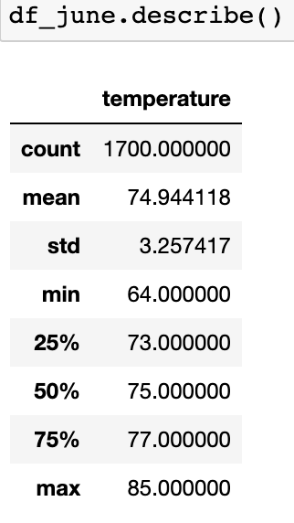
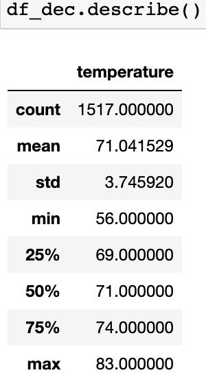

# surfs_up
---

## Overview
This paper will provide a statistical analysis to gather temperature data for the months of June and December in Oahu, in order to determine if the surf and ice cream shop business is sustainable year-round.

### Aim

The aim of this paper is to determine the following:
  1. Summary Statistics for June
  2. Summary Statistics for December

---
## Analysis & Results:

Using the code in [SurfsUp_Challenge.ipynb](SurfsUp_Challenge.ipynb) file, a table summarising some temperature statistics for the months of June and December can be created. The below images are statistics for June and December in Oahu. 

 

 &nbsp;&nbsp;&nbsp;&nbsp;&nbsp;&nbsp;&nbsp;&nbsp;&nbsp;&nbsp;&nbsp;&nbsp;&nbsp;&nbsp;&nbsp;&nbsp;

June Statistics &nbsp;&nbsp;&nbsp;&nbsp;&nbsp;&nbsp;&nbsp;&nbsp;&nbsp;&nbsp;&nbsp;&nbsp;&nbsp;&nbsp;&nbsp;&nbsp;&nbsp;&nbsp;&nbsp;&nbsp;&nbsp;&nbsp;&nbsp;&nbsp;&nbsp;&nbsp;&nbsp;&nbsp;&nbsp;&nbsp;&nbsp;&nbsp; December Stastics

Looking at the statistics above, it can be determined;
  1. The average temperature in June was 74.9 degrees, and in December it was 71.0, showing only 4 degrees of flucuation, on average, between the two months. 
  2. Similary, the maximum temperatures of the June and December was 85 and 83 degrees, respectively, showing little difference. 
  3. Though the max temps were similar, December saw a low of 56, compared to 64 degrees in June. This, combined with December having a larger standard deviation (3.75 compared to 3.26), implies there is slightly more flucuation in temperature in December than in June. 

---
## Summary:

In summary, though December sees similar maximum temperatures to June, and their average is only 4 degrees lower, the standard deviation implies there is slightly more flucutation in December, which may not be condusive to ice cream selling. 

Two additional queries that could be performed to gain more insight into the weather data is; 
  1. Analysis into precipitation levels. 
    - Though the temperatures may be similar on average, more rain in a certain month could contribute to fewer ice cream sales. 
  2. Dig further into local temperature statistics.
    - This analysis was done on Oahu as a whole. It could be more beneficial to dig into local weather, to get a better analysis at certain locations. 
